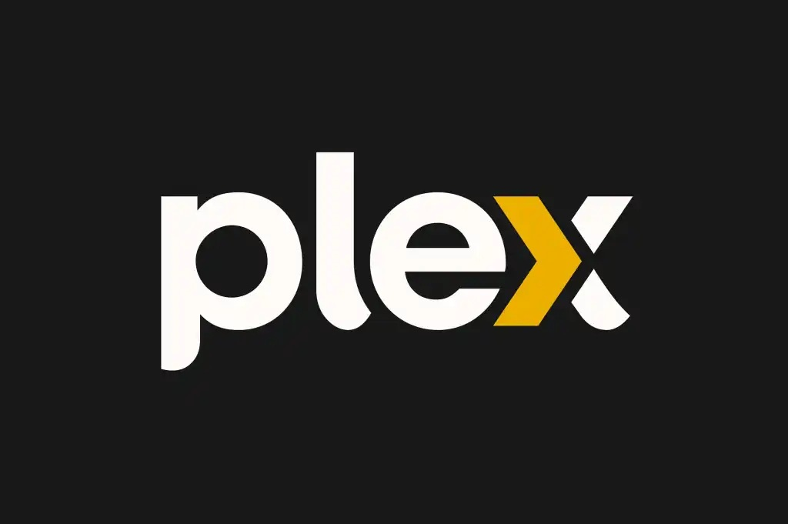

Plex is a video streaming software for people with home libraries. This could include movies, tv shows, music, or home movies. Plex has a huge library of MetaData. MetaData is the data that comes along with primary data like movies or music. For Example, it could be the movie posters, titles, or even time stamps. 

When someone takes a raw movie data, it does not have any of the MetaData to go along with it which is where Plex comes in and provides it to make the viewing experience similar to Netflix. Otherwise the movies and other content would just be abled to play from a folder. 