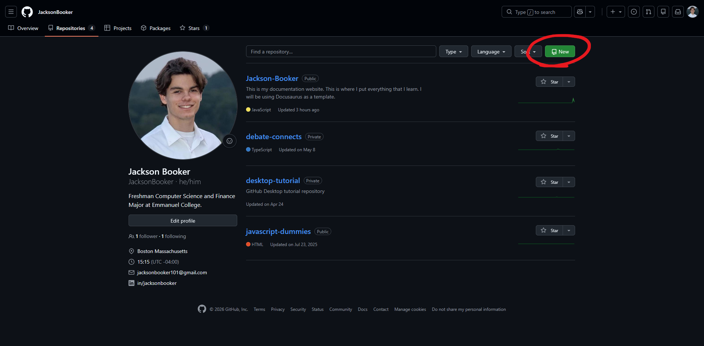
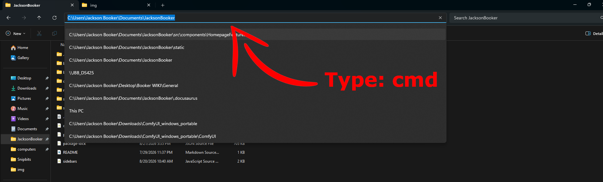

# Documentation Hosting

If you want to make a site just like this one than you can follow this guide that I have put together. This site cost around $10 a year to maintain, but you will have full customizablity, custom domain name, and access to an already made template. If that sounds good than stay here and make your own documentation and blogging site. Before anything you must have an installation of [[Docusaurus]] on your local machine. This is if you want to follow along exactly to what I am doing.

## Creating a Github Repo

First, you are going to want to sign up or log in to your [github](https://www.google.com/url?sa=t&source=web&rct=j&opi=89978449&url=https://github.com/signup&ved=2ahUKEwj0mP6ttbKWAxUYLFkFHfDyChEQFnoECCQQAQ&usg=AOvVaw0a6qEmIZVdziwPUb-hFApr) account. When you get into your account, you will navigate to your profile in the top right hand corner and click "Repositories."

Once you do that, add a name and a description. For the visablitiy make sure that is is "Public" (so cloudflare can see it), and you have "Add README" Deselcted. You can select "No .gitignore", and "No license" to follow along what I did. Then you can select "Create repository."

## Pushing the Site to Github

This next step will be openning bash in the Docusaurus root folder. You can go to your folder where your whole Docusaurus site will be held. It should be the main folder where every other folder and doc lives. For windows users, you can double click the entire pathway and type "cmd", and then press enter. That will pop up the terminal. **Yes the terminal, and please don't be scared if you are just starting out, you won't break anything.**  In my example I have titled my Docusaurus site to JacksonBooker but your might also be called "My Docusaurus" or "Docusaurus."

Now that you are in the terminal