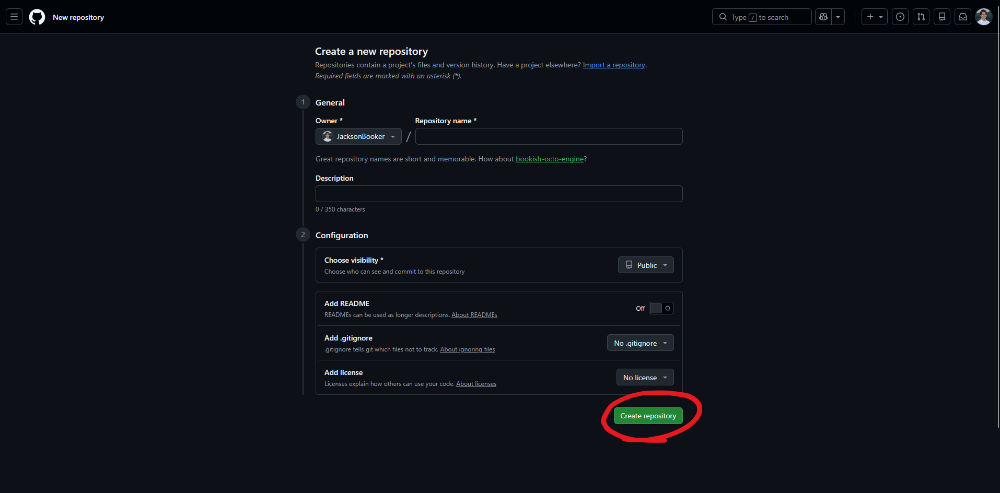
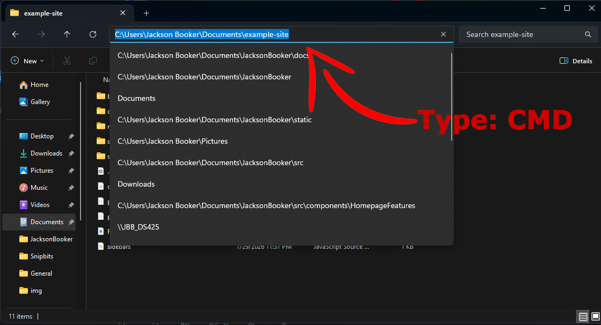

# How To Get Free Hosting For Docusaurus?

If you want to make a site just like this one than you can follow this guide that I have put together. This site cost only  $10 a year to maintain, and you will have full customization, custom domain name, and access to an already made template. If that sounds good than stay here and make your own documentation and blogging site. Before anything you must have an installation of [Docusaurus](./General/How to Use Docusaurus?) on your local machine. This is if you want to follow along exactly to what I am doing.

## Creating a Github Repo

First, you are going to want to sign up or log in to your [github](https://www.google.com/url?sa=t&source=web&rct=j&opi=89978449&url=https://github.com/signup&ved=2ahUKEwj0mP6ttbKWAxUYLFkFHfDyChEQFnoECCQQAQ&usg=AOvVaw0a6qEmIZVdziwPUb-hFApr) account. When you get into your account, you will navigate to your profile in the top right hand corner and click "Repositories."


Once you do that, add a name and a description. For the visibility make sure that is is "Public" (so cloudflare can see it), and you have "Add README" deselcted. You can select "No .gitignore", and "No license" to follow along what I did. Then you can select "Create repository."



## Pushing the Site to Github

This next step will be opening bash in the Docusaurus root folder. You can go to your folder where your whole Docusaurus site will be held. It should be the main folder where every other folder and doc lives. For windows users, you can double click the entire pathway and type "cmd", and then press enter. That will pop up the terminal. **Yes the terminal, and please don't be scared if you are just starting out, you won't break anything.**  In my example I have titled my Docusaurus site to JacksonBooker but your might also be called "My Docusaurus" or "Docusaurus."



Now that you are in the terminal, you can follow this [Github Article](https://docs.github.com/en/migrations/importing-source-code/using-the-command-line-to-import-source-code/adding-locally-hosted-code-to-github#initializing-a-git-repository) explaining how to import local files into your github. The jist of it is:
```
git init -b main
git add .
git remote add origin https:theActualLinkOfYourGithubRepo
git push -u origin main
```
Once you do that for the first time, pushing your updates and changes gets much easier. When you make a change that you want to add to your repo you type these three lines in your terminal, that is in your root folder. It looks like this:
```
git add .
git commit -m "Name Of Your Changes"
git push
```
## Connecting Github to Cloudflare


