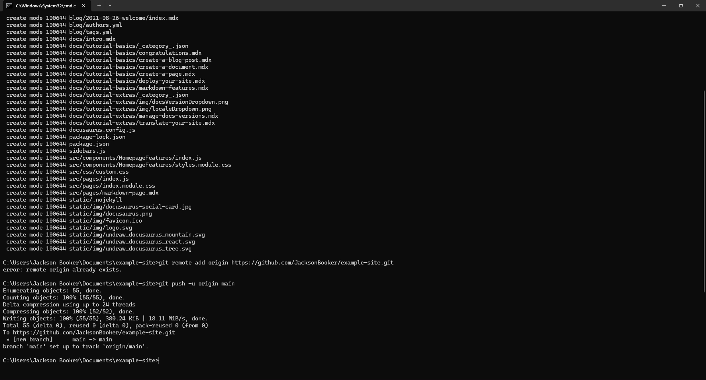
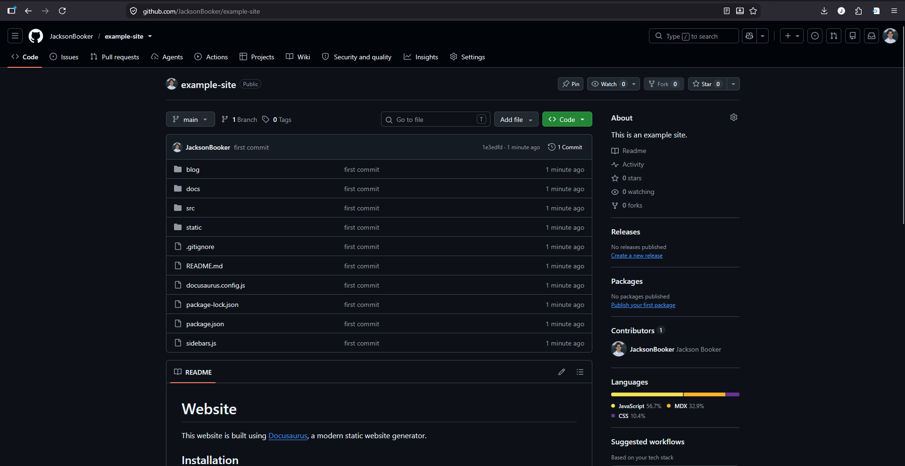
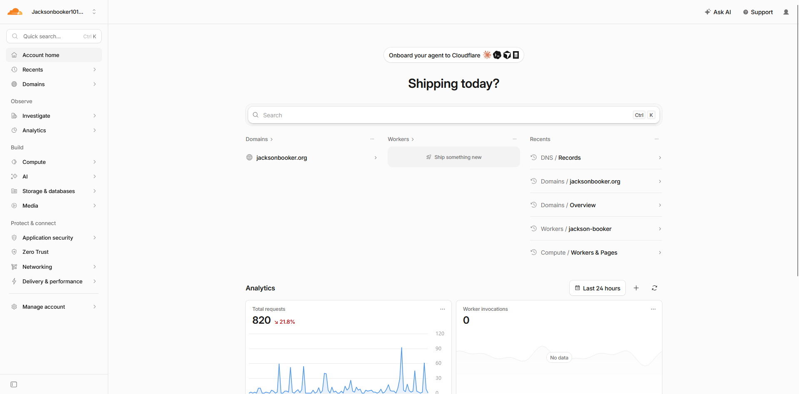
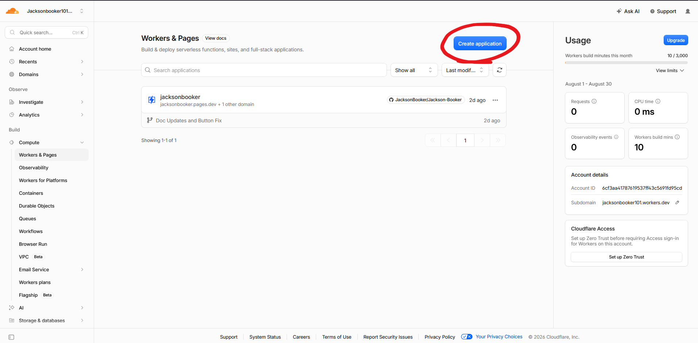
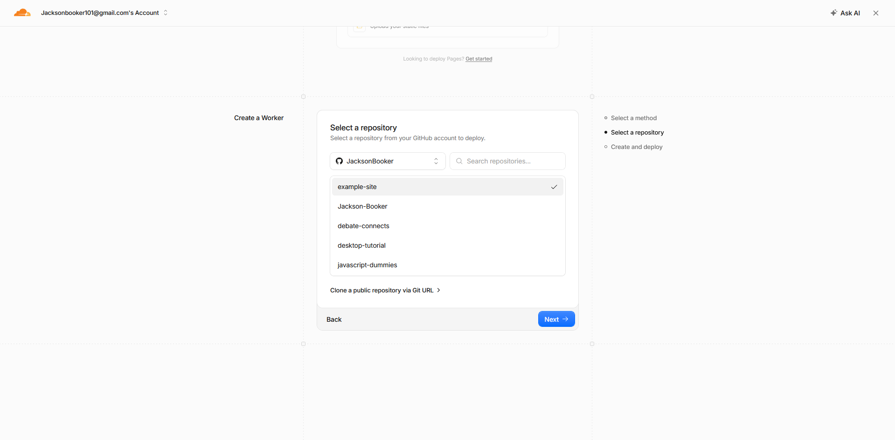
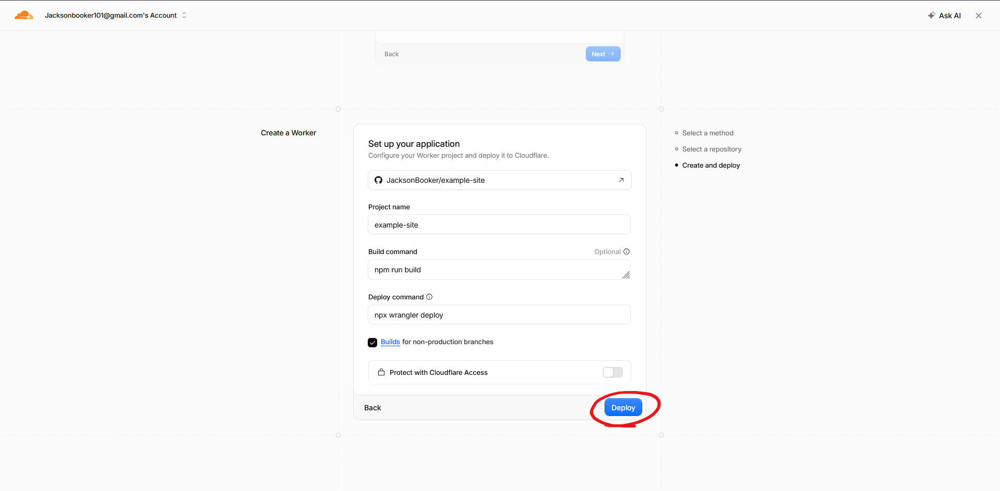
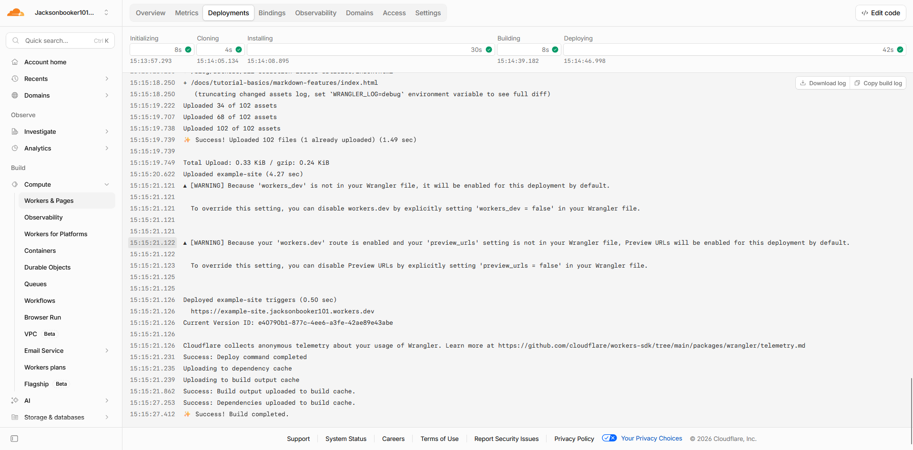
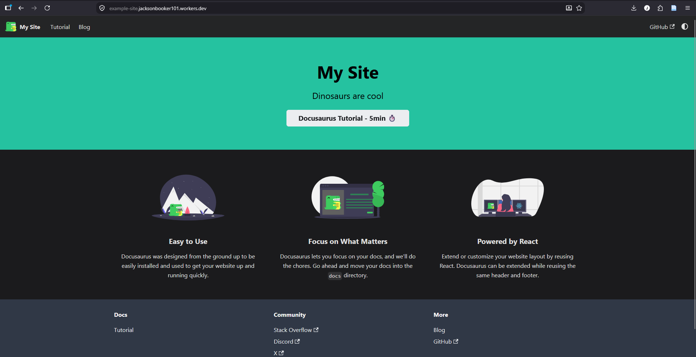

# How To Get Free Hosting For Docusaurus?

If you want to make a site just like this one, than you can follow this guide that I have put together. This site cost only  $10 a year to maintain, and you will have full customization, custom domain name, and access to an already made template. If that sounds good than stay here and make your own documentation and blogging site. Before anything you must have an installation of [Docusaurus](./how-to-use-docusaurus.md) on your local machine. I have an article about how to download and create your own Docusaurus site linked [here](./how-to-use-docusaurus.md). 

## Creating a Github Repo

First, you are going to want to sign up or log in to your [github](https://www.google.com/url?sa=t&source=web&rct=j&opi=89978449&url=https://github.com/signup&ved=2ahUKEwj0mP6ttbKWAxUYLFkFHfDyChEQFnoECCQQAQ&usg=AOvVaw0a6qEmIZVdziwPUb-hFApr) account. When you get into your account, you will navigate to your profile in the top right hand corner and click "Repositories."


Once you do that, add a name and a description. For the visibility make sure that it is "Public" (so cloudflare can see it), and you have "Add README" deselcted. You can select "No .gitignore", and "No license" to follow along what I did. Then you can select "Create repository."


## Pushing the Site to Github

This next step will be opening bash in the Docusaurus root folder. You can go to your folder where your whole Docusaurus site will be held. It should be the main folder where every other folder and doc lives. For windows users, you can double click the entire pathway and type "cmd", and then press enter. That will pop up the terminal. **Yes the terminal, and please don't be scared if you are just starting out, you won't break anything.**  In my example I have titled my Docusaurus site to example-site but your site will be named what ever you titled your project.


Now that you are in the terminal, you can follow this [Github Article](https://docs.github.com/en/migrations/importing-source-code/using-the-command-line-to-import-source-code/adding-locally-hosted-code-to-github#initializing-a-git-repository) explaining how to import local files into your github. The jist of it is:
```
git init -b main
git add .
git commit -m "first commit"
git remote add origin https:theActualLinkOfYourGithubRepo
git push -u origin main
```
If you did everything correctly your terminal should look like this:


Then you can make sure everything is working correctly by going back to your initial repository that you made which should look like this:



Once you do that for the first time, pushing your updates and changes gets much easier. When you make a change that you want to add to your repo then you type these three lines in your terminal, that is in your root folder. It looks like this:
```
git add .
git commit -m "Name Of Your Changes"
git push
```
## Connecting Github to Cloudflare

Now it is time to connect the documents from github to your Cloudflare page. First, login to [Cloudflare](https://dash.cloudflare.com) or create an account. Once you do that you will want to buy  your domain name from [Cloudflare](https://www.cloudflare.com/products/registrar/) so that way you don't have to connect it from a different service. Once you have acquired your domain name you will now log in to your [Cloudflare Dashboard](https://dash.cloudflare.com). It should look something like this:



Now that you are here, type in "Workers & Pages" in the quick search bar. It will bring you to a this page where you will create your application. Next you will select "Create Application" in the top right corner.



You should now see a page that asks you, how you want to upload your files. You are going to select something called "Continue with GitHub" and then click Next. After that it will have you select your repository. If you made this account for the first time it will have you sign in to your GitHub account to make sure that it is you. Once you can, select the repo that we just uploaded. For me, it looks like this:



On the last step you can edit your project name and you want to make sure that in the "Build Command" section that you have `npm run build`  typed in, so that you can later trouble shoot easier. Once all is good you can select "Deploy".



After that, you should see Cloudflare start cloning, installing, and building your site. If your site gets stuck on the build process, you should look at some [troubleshooting](./how-to-use-docusaurus.md#troubleshooting) that I have documented. Otherwise it should look like this:



Now all you have to do is go to the "Domains" tab and toggle on the "Production" URL. You can also attach your domain through there. Now you are officially done and by typing in the provided URL you can see your very own publicly hosted site: 



Now you can use this workflow to create any documentation sites that you want. You can also connect with me on [LinkedIn](https://www.linkedin.com/in/jacksonbooker/), just remember to provide a note saying you found me through my website. Otherwise, thank you for being a reader.