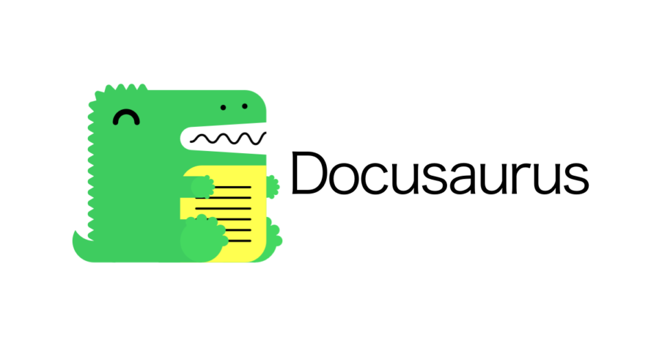
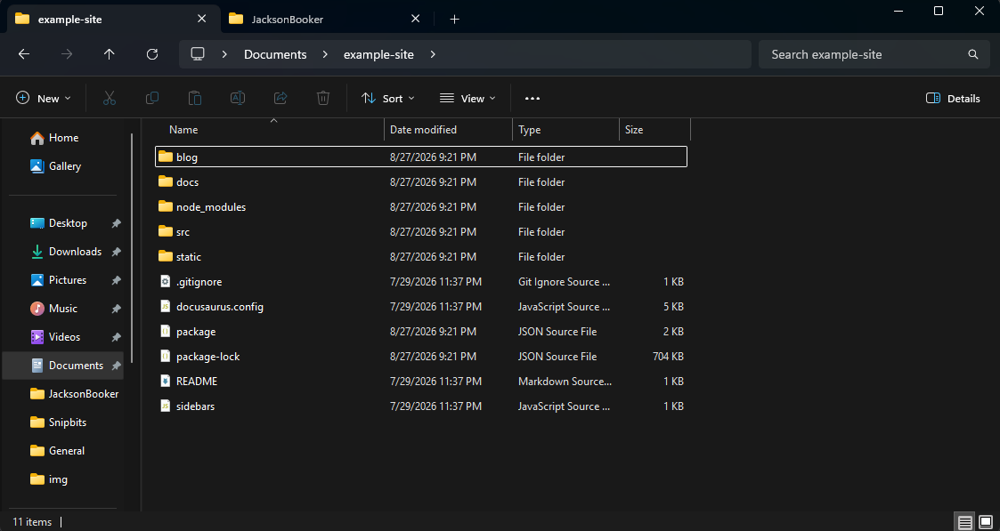
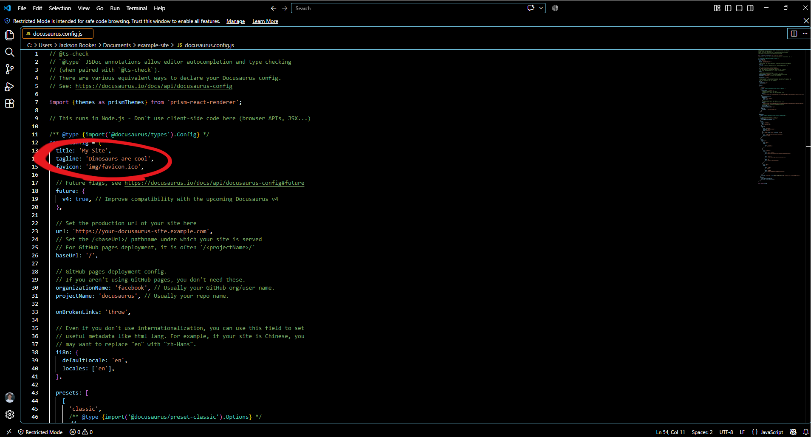

# How To Use Docusaurus?

Docusaurus is a great open source solution to organizing and uploading your documentation online for others to see. Docusaurus uses [Markdown](./how-to-write-good-documentation.md) files to create the documents. This was created my Meta and is under an MIT License. This is primarily used for projects to host there documentation, but many people use the software for other things. For example, this site was built with Docusaurus.

## How to Download and Get Started?

Downloading Docusaurus is really easy if you follow these steps. You will also learn how to download it dependencies, and clone files from Github. This installation process will be coming from the [Docusaurus Installation Guide](https://docusaurus.io/docs/installation) itself, so make sure to review that for more information. 

### Downloading Dependencies

**Dependencies:** Before downloading anything you must check to see if you have Node.js 20.0 version or newer. To see if you have it downloaded, pull up a terminal, and type "`node -v`". This will show you the current version of Node.js that you have. If you have Node.js installed it should look like this:


If you do not have it installed follow this [Node.js](https://nodejs.org/en/download) installation. Once the dependencies are installed then you can move on to downloading the Docusaurus files and folder.

### Cloning Docusaurus Files and Folders

Docusaurus has provided a "create-docusaurus" command line tool to help with the installation. You are going to want to type this into the same empty terminal.
```
npx create-docusaurus@latest my-website classic
```
For the "my-website" piece, you can change that to whatever you like. I my demonstration I am using "example-site". It should look like this:


Once downloaded, you will need to find the folder on your computer. The path should be C:\Users\YOURNAME\YOURSITE. You can move your site to anywhere you want. I have personally moved my website to my "Documents" folder for easy use. If everything worked right then your folders should look like this:



## What Files Do I Need To Use? 

The two places that you need to work in to customize your space is `docusaurus.config.js` file and the `docs` folder. Editing anything else is optional. For more information you can go to this [Docusaurus Configuration Article.](https://docusaurus.io/docs/configuration) For the website customization, all you need is the `docusaurus.config.js`, and it is super easy to use. I like to open this file in Visual Studio Code, a code editor that many people often use, to make edits. When you open your config file, you can start editing the orange text. The green text is there for information on what to write and how to use. I strongly suggest reading through it before changing anything. 



Once you change your the edit your information, you will have your personalized documentation website. The second item that you need to change is the `docs` folder. The `docs` folder is what holds all of your markdown files and turns them into the documents that you can see online. What I did is, I pointed Zettlr, a markdown editor, to my `docs` folder so I can edit the markdown files and folder. I explain a little about this in my other article, [How To Write Good Documentation?](.\how-to-write-good-documentation)

Of course there are other modifications you can do like changing all the colors by going to this path `C:\Users\YOURNAME\Documents\example-site\src\css` or adjusting your sidebars by going to `sidebars.js`, but Docusaurus provides detailed articles for you to figure that out.

### Testing Your Files

When testing your site, you open your terminal, that is open in your folder. You can do this by writing "cmd" in your Docusaurus root folder. Once your in the terminal, type:
```
npm run start
```
This will run your site locally so that you can see how it looks in a browser. You can eventually add your site online for $10 a year, and with a custom domain by following my other article that I wrote called [How To Get Free Hosting For Docusaurus?](./how-to-get-free-hosting-for-docusaurus.md)

## Troubleshooting

Initially, when I ran `npm run build` I would get an error because of broken links. I figured out that in the `docusaurus.config.js` file that I need to adjust the code from,
```
 onBrokenLinks: 'throw',
```
to
```
 onBrokenLinks: 'ignore',
```
for the site to build correctly.