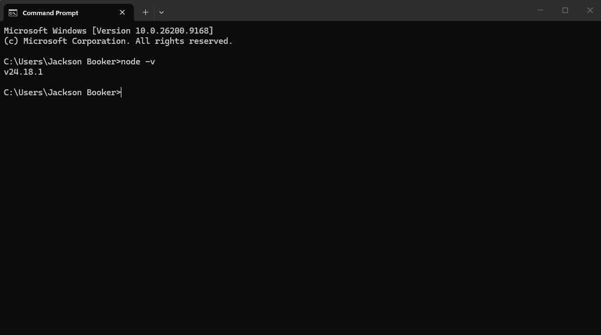
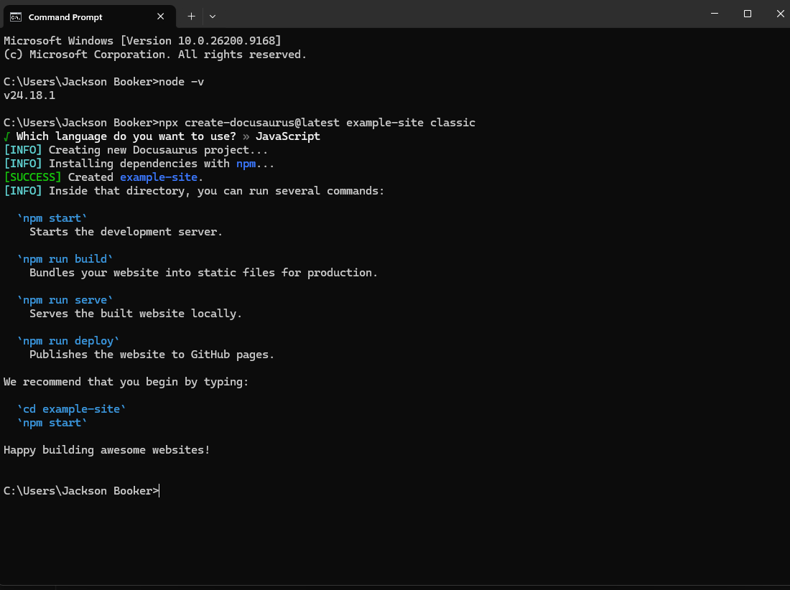

# How To Use Docusaurus?

Docusaurus is a great open source solution to organizing and uploading your documentation online for others to see. This was created my Meta and is under an MIT License. This is primarily used for projects to host there documentation, but many people use the software for other things. For example, this site was built with Docusaurus.

## How to Download and Get Started?

Downloading Docusaurus is really easy if you follow these steps. You will also learn how to download it dependencies, and clone files from Github. This installation process will be coming from the [Docusaurus Installation Guide](https://docusaurus.io/docs/installation) itself, so make sure to review that for more information. 

### Downloading Dependencies

**Dependencies:** Before downloading anything you must check to see if you have Node.js 20.0 version or newer. To see if you have it downloaded, pull up a terminal, and type "`node -v`". This will show you the current version of Node.js that you have. If you have Node.js installed it should look like this:



If you do not have it installed follow this [Node.js](https://nodejs.org/en/download) installation. Once the dependencies are installed then you can move on to downloading the Docusaurus files and folder.

### Cloning Docusaurus Files and Folders

Docusaurus has provided a "create-docusaurus" command line tool to help with the installation. You are going to want to type this into the same empty terminal.
```
npx create-docusaurus@latest my-website classic
```
For the "my-website" piece, you can change that to whatever you like. I my demonstration I am using "example-site". It should look like this:


Once downloaded, you will need to find the folder on your computer. The path should be C:\Users\YOURNAME\YOURSITE. You Can move your site to anywhere you want. I personally keep my website in my "Documents" folder. 

## What Files Do I Need To Use? 

## How to Write Your Documentation?

## How to Host Your Site?

## Troubleshooting Errors
