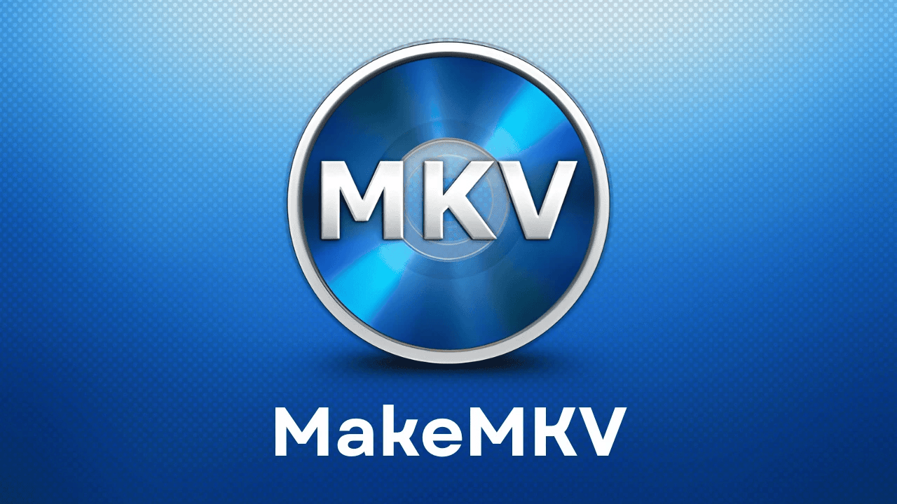

 

# What is DVD Ripping?

DVD, CD, and Blue-ray, ripping is how you take your physical media and turn it into digital files. This is a great way to store media so that it is accessible and efficient. In other words you are trying to make your own Netflix, but with your own media. 