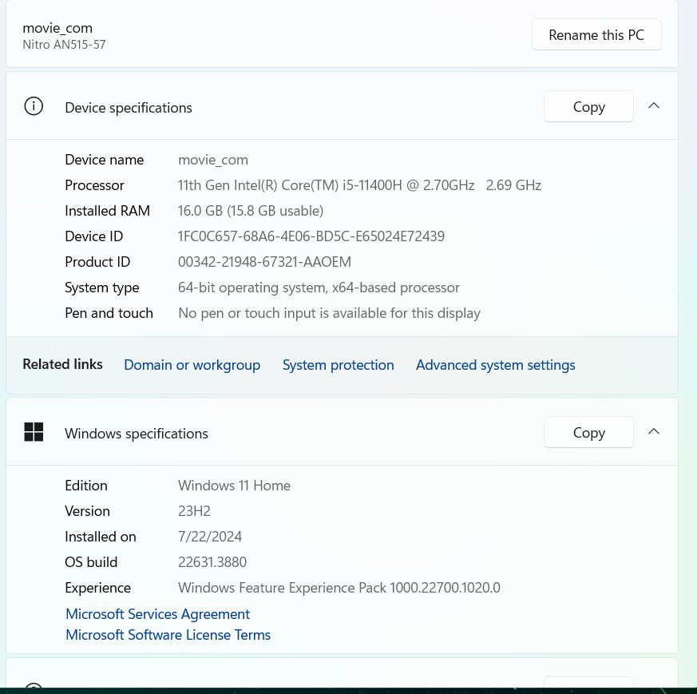
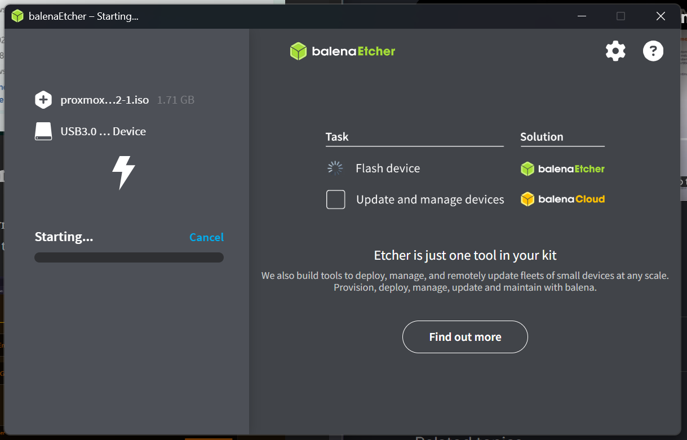

The laptop that I will be using is and acer nitro 5. The specs are in the following photo. Something that makes this a good laptop for this server is that it has 16 GB's of RAM which will allow more VM's to run on the machine at once. 

## Downloading ProxMox

The first step is to download the "Proxmox VE ISO Installer". You will want to download the lastest version. For me that is 9.2. 

Once that is downloaded, you can move on to booting Proxmox from you USB flashdrive. Download Balena Etcher, and select the ISO file that you just downloaded. Then select your thumbdrive as the target. 
**DO NOT SELECT YOUR C: DRIVE!!!**

Safely eject your thumbdrive and plug it into your computer that you are installing Proxmox on.

Boot proxmox on your computer and then in the wizard choose install graphically. 

When choosing the filesystem, I went with EXT4 because