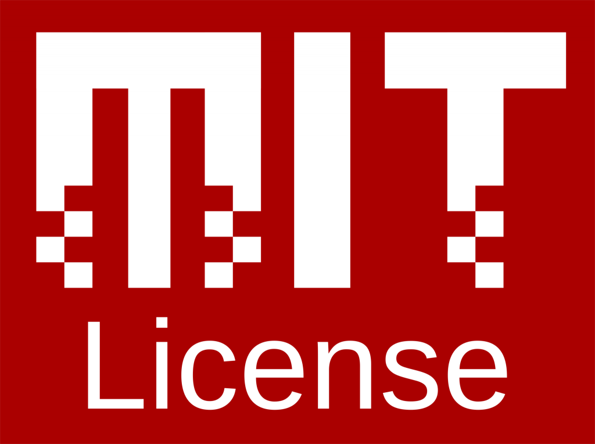

# What is An Open Source License?

An open source license is a legal agreement for open software. There are three main categories in Open Source License which are Public Domain, Permissive, and Copyleft. Copyleft licenses can be drastically different but the end idea is very similar. A site called [open source initiative](https://opensource.org/licenses) has a data base of all open source license which is a great resource for further research. This doc is for me to continue to edit and update licenses that I am familiar with. 

## Public Domain

Public Domain Licenses are legal agreements that state that no one owns the code, not even the author. No one can copyright the code, and everyone is allowed to use it for what ever they want. People and businesses are allowed create applications with public domain code and sell it for profit. 

## Permissive

Permissive Licenses are legal agreements that the author still maintains control of the code but anyone can use it. Anyone can use and manipulate the code in anyway which they could later sell if they choose to.

## Copyleft 

Copyleft Licenses are legal agreements that when anyone uses the code in there work in any way, the new code has to be released in the same way and under the same license. This means that it is much more difficult to make money on this code because it can not be proprietary.