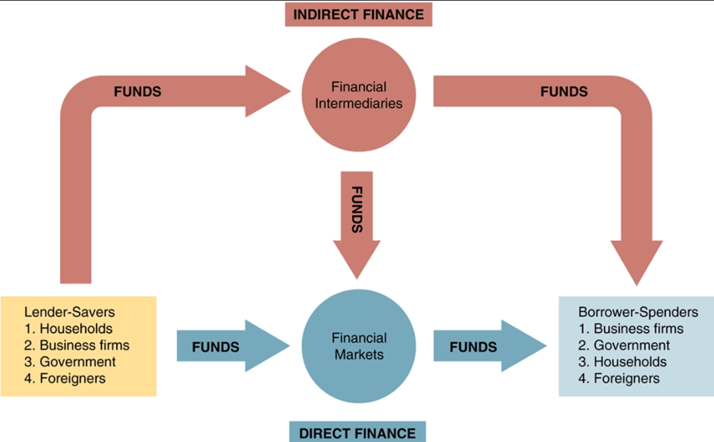

## Ethical Finance

Andrew Carnegie is the one who started "ethical finance." What that means is wealthy people should use there money for good and to help less advantaged people. In 1889, Carnegie wrote "The Gospel Of Wealth" which stated the rich had "a moral obligation to distribute [their money] in ways that promote welfare and happiness of the common man." There are also many examples of rich people using there money to help others like, Bill & Melinda Gates Foundation or the Open Society Foundation. This is often referred to as Philanthropy.

## What is A Financial Market?

Financial Markets transfer money from people who have large surpluses of money and resources to people that have a shortage of money and resources. When financial markets do this, it promotes economic efficiency and growth.

### What Are The Differences Between A Debt Market and A Equity Market?

In a debt market, investors buy others debt and earn an interest on the payments the borrower pays back. There are different maturity dates for these debt investment such as: <1 year is short term, ≥ 10 years is long term, and between the two is intermediate term. Debt markets are fixed and the companies performance (other than going out of business), does not affect the investment.

On the other hand, we have equity markets. This is where investors pay a price for a share of the businesses assets and future income. The business also gives out dividends as payment for owning the shares of stock. Equity markets are not fixed investments and the profits of the company impacts the price of the investment. Also, when a security is bought, they are assets but when they are issued, they are a liability to the issuer.

Also, debt holders are paid first if the company goes under and then the share holders are paid. Additionally, equity markets refer to there investments as securities which is a broad category that represents, stocks, ETFs, Mutual Funds, and many others. A debt market refers to there investments as a bonds, which is a contract to make payments periodically.

Quick Definition: **Interest Rate** is the cost of borrowing money and an added price on loans.

## What are Financial Intermediaries?

Financial Intermediaries are institutions that take money from people that have money saved and loan it out to borrowers. The most common example is a bank. A bank takes many people's savings accounts and loans it to people so they can buy a house. They get a mortgage and pay the bank periodically until there is no outstanding debt. Other examples include insurance companies, pension funds, and investment banks. 

In the photo you can see that there is two different types of funding and loaning. The indirect finance is the part where we have financial intermediaries that facilitate the funds. Furthermore, we have direct finance where people you there funds to purchase directly into financial markets without an institution in the middle.

There is also something called primary and secondary markets. The difference is that primary markets is when you first buy something from the company like buying stock issued by Apple. Secondly markets is like buying stock on retail apps like Robinhood.

## What is Money?

Money is anything that is generally accepted as payment for goods and services. In the 1600's people used to use seashells as currency to exchange goods and services. 

### Characteristics

Money must have three characteristics which are medium of exchange, unit of account, and store of value. If a currency can not do that, then it is not money.

### What are Monetary Aggregates?

Monetary Aggregates using the concept of how fast can you turn something into money or somethings liquidity. Monetary Aggregates have an inclusive relationship, meaning the next one includes all the others.

- M0 and M1 are cash, coins, and things that can be converted to money extremely fast
- M2 includes M1 shorterm deposits, short-term bonds, and low risk mutual funds to receive money the next day
- M3 includes M2 longer-term time deposits and any mutual fund
- M4 includes M3 and all other deposits

